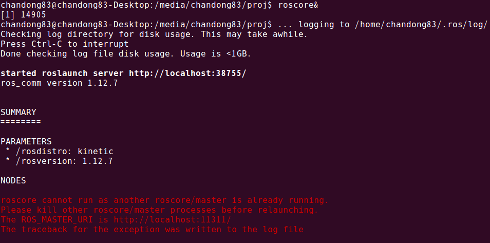
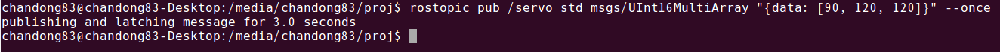

# ros_rosserial_multi_servo_control_for_arduino
# 아두이노에서 ROS 시리얼 + 다중 서보 제어 (STM32 기준)

## 함께 보면 좋은 것들
~~~~~
아두이노 ROS 사용하기
http://chandong83.blog.me/220851270328

아두이노(arduino) ROS & STM32 - Serial 선택하기
http://chandong83.blog.me/221009668897

아두이노 ROS 서보 예제 돌려보기 - ft.ROSSerial
http://chandong83.blog.me/221068884860
~~~~~

## 실행 방법
~~~
Ubuntu PC
# ros 시작
$ roscore&

# ROS 시리얼 시작
# rosrun rosserial_python serial_node.py _port:=[Arduino ROS 시리얼 포트]
$ rosrun rosserial_python serial_node.py _port:=/dev/ttyUSB0

# 토픽 메시지 전송
# rostopic pub /servo std_msgs/UInt16MultiArray "{data: [서보1 각, 서보2 각, 서보3 각]}" --once
$ rostopic pub /servo std_msgs/UInt16MultiArray "{data: [90, 120, 120]}" --once
~~~

### roscore 실행 화면

### rosrun 실행 화면

### rostopic 실행  화면

http://blog.naver.com/chandong83
